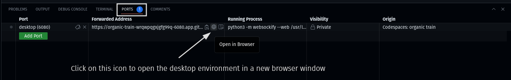

# Python3 + Lighweight desktop environment codespace

This repository contains a pre-configured codespace with Python 3.11, a lightweight desktop environment, and a Visual Studio Code for the Web (with the Python and Pylance extensions) instance -- all accessible from a web browser.

## Getting Started

Click the badge below to to create a codespace and start coding. :rocket:

## Connecting to the desktop environment

1. Open the `Ports` view, select the `Desktop` port, and click the Globe icon.

2. In the browser window that appears, click the *Connect* button and enter the desktop password (`vscode` by default).

## Further reading

- [GitHub Codespaces Docs](https://docs.github.com/en/codespaces)
- [Development Container Specification](https://github.com/devcontainers/spec)
